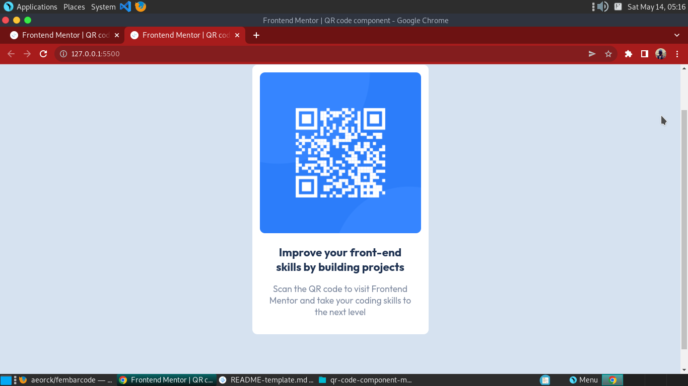

# Frontend Mentor - QR code component solution

This is a solution to the [QR code component challenge on Frontend Mentor](https://www.frontendmentor.io/challenges/qr-code-component-iux_sIO_H). Frontend Mentor challenges help you improve your coding skills by building realistic projects. 

## Table of contents

- [Overview](#overview)
  - [Screenshot](#screenshot)
    -[Desktop Preview](#desktop)
    -[Mobile Preview](#mobile)
  - [Links](#links)
- [My process](#my-process)
  - [Built with](#built-with)
  - [What I learned](#what-i-learned)
- [Author](#author)


## Overview

### Screenshot
#### desktop

#### mobile


### Links

- Solution URL: [Add solution URL here](https://github.com/aeorck/fembarcode)
- Live Site URL: [Add live site URL here](https://fembarcode.netlify.app)

## My process

### Built with

- Semantic HTML5 markup
- CSS custom properties
- Flexbox
- Mobile-first workflow


### What I learned

Proper implementation of workflow.

```html
<h1>Some HTML code I'm proud of</h1>
```
```css
.proud-of-this-css {
  color: papayawhip;
}
```
```js
const proudOfThisFunc = () => {
  console.log('🎉')
}
```


## Author


- Frontend Mentor - [@yourusername](https://www.frontendmentor.io/profile/aeorck)
- Twitter - [@yourusername](https://www.twitter.com/datphoenixx)


